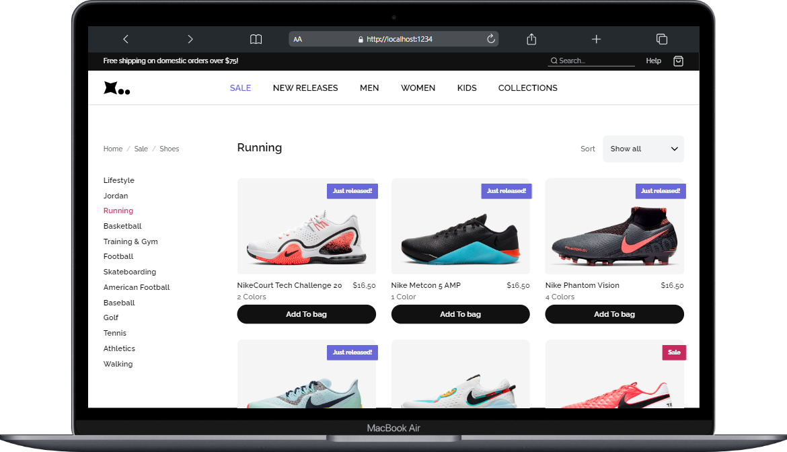
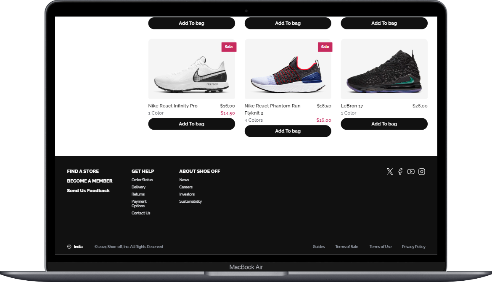
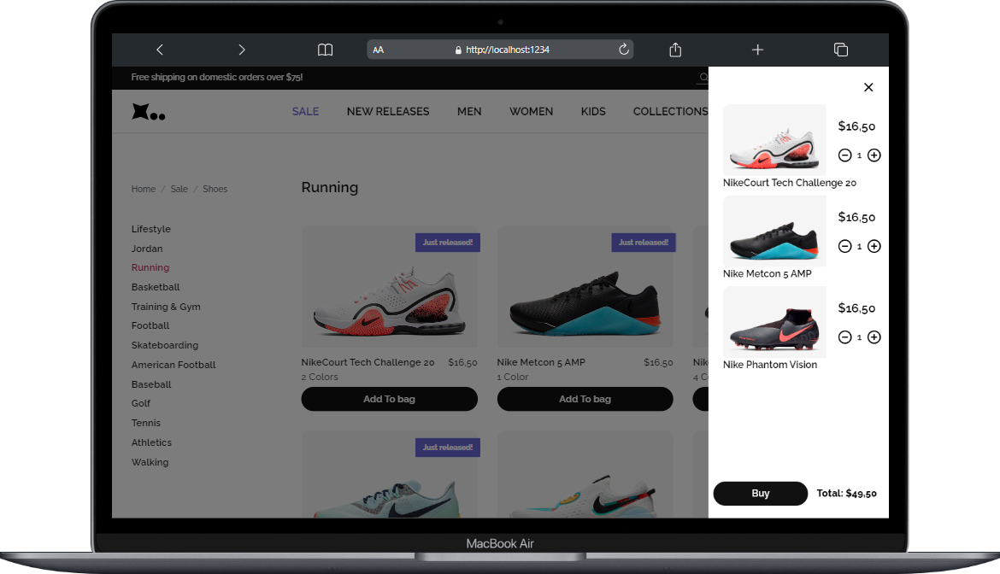

# Shoe-off: Where Style Meets Code! 👟💻

Welcome to Shoe-off, your ultimate destination for stylish shoes with a tech twist!

## Visit the Site 🌐
Ready to dive into the world of awesome shoes? Visit Shoe-off [here](https://example.com) 🛍️✨

## About the Project
Shoe-off isn't just an online shoe store; it's a vibe! This project showcases my frontend skills using ReactJS and Tailwind CSS, delivering a lit shopping experience as stylish as the shoes we sell.

## Key Features 🚀
1. **ReactJS Magic ✨**: Enjoy instant, jaw-dropping responsiveness. Say goodbye to boring page reloads; Shoe-off delivers snappy, dynamic action!
   
2. **Tailwind CSS Swag 🎨**: Styled for perfection with Tailwind CSS, our website looks flawless on any device, from giant desktops to tiny phones.

3. **Progressive Web App (PWA) Transformation**: Transformed into a PWA using IndexedDB, Cache API, and Service Worker for enhanced offline functionality and performance.

4. **Add to Cart Feature**: Added a seamless 'Add to Cart' functionality, allowing users to easily add and purchase their favorite shoes.

## Demo
- 
- 
- 
- 

## Technologies Used
- ReactJS
- Tailwind CSS
- IndexedDB
- Cache API
- Service Worker

## Contributing
Found a bug? Have a feature request? Contributions are welcome! Please open an issue or submit a pull request.

## License
This project is licensed under the MIT License - see the [LICENSE](link-to-license-file) file for details.
